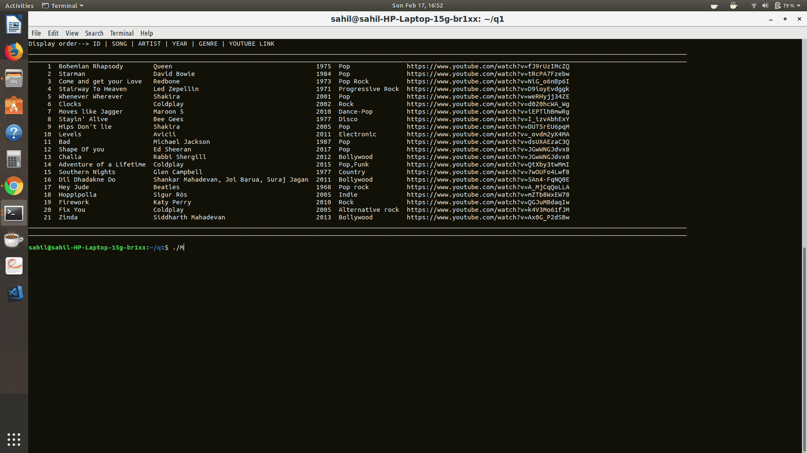

# Song-Diary
Maintain a list of all your favourite songs !!
/**********************************************************************************************************

                                            SONG DIARY

                                       MADE BY : SAHIL MANOJ BHATT

**********************************************************************************************************/

WELCOME TO YOUR VERY OWN, USER-FRIENDLY SONG DIARY
This is a script to store all your favourite songs and all the details about them.

INSTRUCTIONS ON HOW TO USE THIS SONG DIARY
_____________________________________________

1)Execute the MAIN.sh script using ./MAIN.sh
2)The user will be prompted with a text, asking him/her to enter what they wish to do with the collection of songs.
3)The corresponding number must be entered by the user.
4)Depending on the option selected,one of the following scripts will run:-

                If user types 1 -> Script to add songs and corresponding details
                              a) User must then enter the name of the song,the artist,the year it was released,genre and youtube link
                                b)If nothing is entered in any field, then it will remain blank and the user can edit it later

                If user types 2 -> Script to edit songs and corresponding details
                                a)The user can change/modify any field of a given song by simply entering the id of the song, which can be viewed by typing 4 in the execution of the MAIN.sh script.

                If user types 3 -> Script to delete songs
                                a)The user can chan any given song by simply entering the id of the song, which can be viewed by typing 4 in the execution of the MAIN.sh script.

                If user types 4 -> Script to view all the songs
                                a)Simply displays all the songs present in the collection.

                If user types 5 -> Script to view song relevant to category
                                a)The user can choose a specific category(ie, Artist,year or genre) to view songs relevant to the entered category.

                                        LAST BUT NOT THE LEAST,HAVE A GREAT TIME MAKING A GOOD COLLECTION OF ALL YOUR FAVOURITE SONGS USING THIS SONG-DIARY.!!!

***********************************************************************************************************

